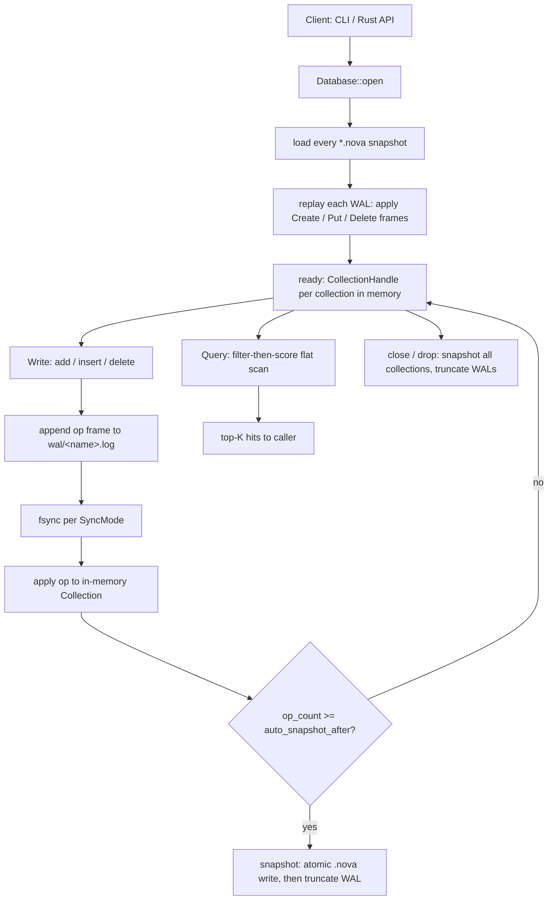

# NovaDB — Codebase Overview

The single map for understanding NovaDB: where execution starts, what the WAL
is and why it exists, how data is stored, and *when* each piece of machinery
runs. Byte-level details of the on-disk formats live in
[`docs/format.md`](format.md) and [`docs/wal.md`](wal.md); this file is the
big picture that ties them together.

---

## 1. What NovaDB is

An **embedded vector database written from scratch in Rust** (v0.1). No
external database underneath — it implements its own:

- storage engine (binary snapshot files + write-ahead log),
- crash recovery (snapshot + WAL replay, torn-tail handling),
- exact flat vector search (cosine similarity, top-K),
- metadata filtering (a tiny query DSL),
- hybrid queries (filter + vector in one pass).

It is a Cargo **workspace** with three members:

| Crate | Role |
| --- | --- |
| `novadb` (root, `src/`) | The library: everything lives here |
| `novadb-cli` (`cli/`) | JSON command-line interface, binary named `novadb` |
| `novadb-benchmarks` (`benchmarks/`) | Criterion benchmarks (search latency, insert throughput) |

`tests/` holds end-to-end integration tests (including crash recovery),
`examples/basic.rs` a runnable library walkthrough, `sdk/` a planned Python
SDK (not built yet), and `.github/workflows/ci.yml` the CI pipeline
(fmt → clippy `-D warnings` → `cargo test --workspace` → release build →
benchmark smoke test).

## 2. Repository map — where things live

```text
src/
├── lib.rs          # crate root: re-exports Database, DbConfig, Record, ...
├── config.rs       # DbConfig + SyncMode (WAL flush policy)
├── error.rs        # NovaError enum + Result
├── engine/         # Database lifecycle + hybrid queries
│   ├── database.rs # Database: open/recovery, WAL-first writes, snapshots
│   └── query.rs    # Query: fluent hybrid query builder
├── storage/        # storage engine
│   ├── format.rs   # on-disk byte formats (snapshot + record), CRC32
│   └── collection.rs # Collection: in-memory state + snapshot (de)serialization
├── wal/            # write-ahead log
│   ├── frame.rs    # WalOp / WalFrame encoding, framing, checksums
│   └── log.rs      # WalLog: append-only log file, sync policies, replay
├── vector/         # similarity math
│   ├── cosine.rs   # cosine_similarity, dot_product
│   └── flat.rs     # exact flat top-K search (brute-force scan + heap)
└── metadata/       # filtering
    ├── filter.rs   # Filter AST (Compare / And) + evaluation
    └── parse.rs    # recursive-descent parser for the query DSL
```

## 3. Entry points

There are two ways into NovaDB — both end up at the same place,
`Database::open`.

### CLI (`cli/src/main.rs`)

`main()` parses argv with clap into a `Cli` (global flags `--db`,
`--no-sync`, `--batch`) plus a `Command` enum: `create`, `drop`, `list`,
`info`, `insert`, `get`, `delete`, `records`, `query`, `checkpoint`.

Then `run()` does the whole lifecycle **for one command**:

1. map flags to a `SyncMode`,
2. `Database::open(config)` — this is where crash recovery happens,
3. dispatch the subcommand against the open database,
4. `db.close()` (checkpoint everything),
5. print the result as pretty JSON to stdout (errors go to stderr as
   `error: {err}`), return an `ExitCode`.

Every CLI invocation is one open → operate → close cycle; nothing is kept
in memory between invocations.

### Library

The library entry point is `Database::open(DbConfig::new("/path"))` (exported
from `src/lib.rs`). The lifetime is the same shape as the CLI:

```rust
let mut db = Database::open(DbConfig::new("/tmp/novadb"))?;
db.create_collection("products", 3)?;
db.add("products", &[0.1, 0.2, 0.3], json!({"price": 99}))?;
let hits = Query::new("products", &[0.1, 0.2, 0.3]).top_k(5).run(&db)?;
db.close()?;          // checkpoint
// ...or just drop(db) — Drop does a best-effort checkpoint too
```

`examples/basic.rs` is a runnable version of this.

## 4. What a WAL is, and why NovaDB has one

**WAL = Write-Ahead Log.** The general idea: before you mutate the
in-memory data, first append a description of that mutation to an
append-only log on disk. If the process crashes, you can rebuild the
database by starting from a known-good snapshot and *replaying* the log
from the beginning — every mutation that was acknowledged is in the log.

NovaDB's rule, stated in `src/engine/database.rs`:

> A mutation is serialized into a WAL frame and appended to the log.
> Depending on `SyncMode`, the log is fsynced. **Only then** is the
> mutation applied to the in-memory collection.

So the WAL is the **source of truth for durability**; memory is just a
cache of "snapshot + log so far".

The log is one file per collection, `wal/<collection>.log`, holding a
sequence of **frames**:

```text
┌───────┬─────────┬───────────┬──────────┬──────────┬──────────────┐
│ magic │ version │ seq u64   │ len u32  │ crc32    │ payload      │
│ 0xAD  │ 1       │ (LE)      │ (LE)     │ (LE)     │ bincode WalOp│
└───────┴─────────┴───────────┴──────────┴──────────┴──────────────┘
```

Each frame carries one **operation** (`WalOp`):

| Op | Payload | Meaning |
| --- | --- | --- |
| `Create(dim)` | `u32` | Create a collection with this dimensionality |
| `Put(record)` | `PersistedRecord` | Insert or replace a record |
| `Delete(id)` | `u64` | Delete a record |

Every collection's log **begins with a `Create` frame** — that is what lets
a collection that was created and written but never checkpointed be
reconstructed from nothing but its log after a crash.

The CRC32 covers the payload, so a torn or corrupted frame can be told
apart from a valid one during recovery.

## 5. How data is stored

There are three layers: what's on disk, what's in memory, and the
serialization glue between them.

### On disk

```text
<db dir>/
├── <collection>.nova        # snapshot: full state of one collection
└── wal/
    └── <collection>.log     # WAL: append-only framed operations
```

**Snapshot (`*.nova`)** — a compact, self-contained full state, written
atomically (write `*.nova.tmp`, fsync, rename over the target). Layout:

```text
┌──────────────────────────────────────────────┐
│ Header (32 bytes)                            │
│ magic "NOVA1\0\0\0" | version 1 | dim u32    │
│ next_id u64 | record_count u32 | reserved    │
├──────────────────────────────────────────────┤
│ Block 0: len u32 | crc32 | bincode record    │
│ Block 1: ...                                 │
│ ...                                          │
└──────────────────────────────────────────────┘
```

A snapshot is the whole story by itself: no WAL is needed to load it.
Snapshots contain no tombstones — deletions are dropped at the next
checkpoint, and the snapshot just reflects the resulting live state.

**WAL (`wal/<collection>.log`)** — see section 4. It is append-only and
small: one frame per applied mutation since the last snapshot.

### In memory

The runtime representation of a collection (`Collection` in
`src/storage/collection.rs`):

| Field | Purpose |
| --- | --- |
| `items: Vec<Record>` | live records in insertion order |
| `id_to_index: HashMap<u64, usize>` | id → position in `items` for O(1) point lookups |
| `norms: Vec<f32>` | precomputed L2 norms, so cosine scoring is one dot product per record |
| `next_id: u64` | next auto-assigned id (persisted in snapshots) |
| `op_count: u64` | ops since the last snapshot (drives auto-checkpointing) |

A `Record` is `{ id: u64, vector: Vec<f32>, metadata: serde_json::Value }`.
Deletes **swap-remove** (move the tail record into the hole, fix its map
entry) so `items` stays dense and iteration stays fast. Upserts with an
explicit id replace the record in place.

Each collection pairs its `Collection` with a `WalLog` in a
`CollectionHandle`; the `Database` is a `HashMap<String, CollectionHandle>`
plus the `DbConfig`.

### Serialization

- Operations and record payloads are serialized with **bincode**.
- Metadata travels as a **JSON string** inside the bincode payload
  (`PersistedRecord`), because bincode cannot encode `serde_json::Value`
  directly (it has no `deserialize_any` support). JSON is the interchange
  format at every boundary: CLI input, filter evaluation, and disk.
- Every file/frame carries a **magic + version**, and every payload a
  **CRC32 checksum**, so corruption is detected, never silently accepted.

## 6. When we do what (lifecycle)



### Opening & crash recovery — `Database::open`

1. `create_dir_all` for the data dir and `wal/`.
2. **`load_snapshots()`** — scan `*.nova` files; each is deserialized by
   `Collection::load_snapshot` (header validated, records CRC-checked,
   norms recomputed). A corrupt snapshot fails the open loudly.
3. **`replay_wal()`** — the recovery core, per collection:
   - `WalLog::read_frames` decodes frame by frame until it hits a partial
     frame (**torn tail** — a crash cut a write short) or a bad checksum.
   - If parsing stopped short of the file length, the torn tail is
     **truncated away** so future appends don't strand behind it.
   - A log that starts with the frame magic but parses nothing is a torn
     *first* frame: nothing was ever durable, so it is reset to empty.
   - A log with unrecognizable bytes at the start is corruption — the open
     fails loudly rather than silently discarding data.
   - Surviving frames are replayed through `apply_frame`: `Create`
     materializes the collection, `Put` inserts/replaces, `Delete` removes.
     Replay is **idempotent**, which is what makes checkpointing crash-safe.
   - Frame and op counters are reset so a freshly opened database does not
     immediately auto-snapshot.
4. **`load_wal_only_collections()`** — WAL segments with no snapshot yet
   (collection created and written, never checkpointed). Their `Create`
   frame reconstructs them. A non-empty log without a `Create` frame is
   corruption.

### Writing — the WAL-first path

`db.add(name, vector, metadata)` (and `insert`/`delete`, all identical in
shape):

1. `check_vector` — reject empty vectors and dimension mismatches.
2. `alloc_id` — bump `next_id` (explicit-id `insert` skips this).
3. `wal.append_put` — bincode-serialize the op, write
   `magic | version | seq | len | crc32 | payload` to the log, then fsync
   according to `SyncMode`:
   - `Every` — fsync after **every** append; acknowledged writes survive
     any crash (default, ~11 ms/insert).
   - `Batch(n)` — fsync every `n` appends; a crash may lose at most the
     last `n` (~29 µs/insert).
   - `Never` — no fsync; durability depends on the OS (~14 µs/insert).
4. **Only then** `collection.apply_put` mutates memory (insert, in-place
   replace, or swap-remove for deletes) and recomputes the norm.
5. `maybe_auto_snapshot` — if ops since the last snapshot cross
   `auto_snapshot_after` (default 10,000), checkpoint now.

If the append or fsync fails, the operation errors and memory is untouched —
the WAL-first ordering is the durability contract.

### Reading — hybrid queries

`Query::run` (`src/engine/query.rs`):

1. Look up the collection, validate the probe vector's dimension.
2. `filter_predicate` turns the optional `Filter` into a predicate over
   record metadata. `Filter::matches` evaluates the AST: `Compare(field,
   op, value)` and `And(terms)`. Semantics worth knowing: numeric types
   unify (`1 == 1.0`), a **missing field never matches** any filter, and
   `!=` on a missing field is also false.
3. `search_top_k` (`src/vector/flat.rs`) — the **filter-then-score**
   strategy: brute-force scan every record, skip any failing the
   predicate, score survivors with cosine similarity (query norm +
   precomputed record norm = one dot product each), and keep the top-K in
   a bounded `BinaryHeap` of capacity `k+1`, evicting the worst candidate
   on overflow. Results come back sorted by score descending, ties broken
   by ascending id.

Filtering happens *before* any similarity math, so a selective filter makes
hybrid queries faster, not slower.

### Checkpointing — when snapshots are written

Three triggers, all ending in the same sequence:

1. **Explicit**: `db.snapshot(name)` / `snapshot_all()` (CLI `checkpoint`).
2. **Automatic**: a write crosses `auto_snapshot_after` ops.
3. **Shutdown**: `close()` checkpoints everything; `Drop` does a
   best-effort `snapshot_all` when the handle dies without `close()`
   (e.g. during panic unwinding).

The sequence per collection: `write_snapshot_atomic` writes
`<name>.nova.tmp`, fsyncs, renames over the live snapshot; then
`wal.truncate()` zeroes the log. A crash between rename and truncate is
harmless — replaying the old frames on top of the new snapshot is
idempotent.

### Dropping

`drop_collection` removes the in-memory handle and deletes both the
snapshot and the WAL files (missing files are fine).

## 7. Configuration

`DbConfig` (built with `DbConfig::new(dir)`; `dir` holds snapshots, `dir/wal`
holds logs):

| Field | Default | Effect |
| --- | --- | --- |
| `sync_mode` | `SyncMode::Every` | WAL flush policy (table in §6) |
| `auto_snapshot_after` | `10_000` | ops before an automatic checkpoint compacts the WAL |

## 8. Crash-safety guarantees at a glance

- **WAL-first writes**: memory never contains a mutation that wasn't first
  logged.
- **Recovery = snapshot + replay**: reopen rebuilds exactly the last
  durable state.
- **Torn tails dropped**: a partial frame at the end of a log is discarded,
  everything before it is kept.
- **Idempotent replay** makes snapshot-then-truncate safe across a crash
  at any point between the two steps.
- **Corruption fails loudly**: bad magic, version, or checksum in a
  snapshot or WAL is a hard error on open — never a silent data loss.

## 9. Where to go deeper

- [`docs/format.md`](format.md) — byte-level snapshot format
- [`docs/wal.md`](wal.md) — WAL protocol, sync modes, recovery procedure
- [`docs/query.md`](query.md) — the metadata filter DSL and its semantics
- [`docs/lifecycle.md`](lifecycle.md) — a line-anchored walk through the
  same lifecycle with exact source locations
- `tests/integration.rs` — the crash-recovery scenarios, as executable
  specifications
- `benchmarks/` — Criterion harnesses for search latency and insert
  throughput
